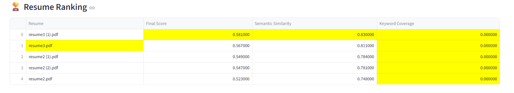
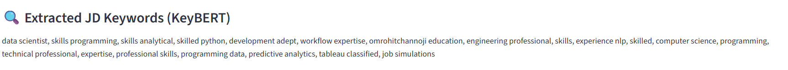

# 🤖 AI Resume Screener & Job Match System

An **NLP-powered Resume Screening System** that matches candidate resumes with a Job Description using **Semantic Similarity (SBERT)** + **Skill Coverage Analytics**.  
The system mimics modern **ATS (Applicant Tracking Systems)** by ranking resumes based on **meaning, not keyword counts**, and identifies missing skills with a detailed Streamlit report.

---

## 🧭 Overview

This project provides a **complete AI pipeline for recruitment automation**:

- 📝 Upload **Job Description PDF**
- 📄 Upload **Multiple Resume PDFs**
- 🔍 Extract relevant skills using **KeyBERT + Custom Skill List**
- 🧠 Generate embeddings using **SBERT (Sentence Transformers)**
- 📈 Measure **semantic match score** (Cosine Similarity)
- 📊 Calculate **keyword coverage score**
- 🧮 Combine both scores for **final resume ranking**
- 🧾 Display detailed reports using an interactive **Streamlit UI**

---

---

## 📸 Screenshots

### 🏠 Dashboard – Upload Section
> Upload a Job Description PDF and multiple Resume PDFs.

<p align="center">
  
</p>

---

### 📊 Ranking Overview
> Resumes ranked using weighted semantic similarity + skill coverage scores.

<p align="center">
  
</p>

---

### 🔍 Detailed Resume Report
> View semantic score, found skills, missing skills, and insights.

<p align="center">
  
</p>

---

### 📌 JD Keyword Extraction
> Extracted JD keywords using KeyBERT + NLP preprocessing.

<p align="center">
  
</p>

---

## 🧠 Core Concepts Behind the System

| Technique | Purpose |
|-----------|---------|
| **SBERT Embeddings** | Understands semantic meaning of resume text |
| **Cosine Similarity** | Measures how close resume meaning matches JD |
| **KeyBERT** | Extracts core skill keywords from JD |
| **Custom Skills Matching** | Detects required job-specific technical terms |
| **Weighted Scoring Engine** | Fair ranking (prevents keyword spamming) |

> **Final Score = 70% Semantic Match + 30% Skill Coverage**  
*(Balanced to avoid spamming keywords while rewarding required skills.)*

---

## 📂 Project Structure

📦 ai_resume_screener/
├── 📜 app.py # Streamlit UI
├── 📦 src/
│ ├── 📄 extract_text.py # PDF text extraction
│ ├── 🧹 preprocess.py # Text normalization & cleanup
│ ├── 🤖 embeddings.py # SBERT embedding generator
│ ├── 📏 similarity.py # Cosine similarity scoring
│ ├── 🔑 keywords.py # KeyBERT + custom skill extraction
│ ├── 🏆 ranking.py # Weighted scoring & reports
│ └── 🔁 utils.py # Pipeline orchestration layer
├── 📄 requirements.txt # Dependencies
└── 📂 test_pdfs/ # Sample resumes + JD (optional)

yaml
Copy code

---

## 🛠️ Technologies Used

| Category | Tools |
|----------|-------|
| **NLP / Embeddings** | SBERT (`all-MiniLM-L6-v2`) |
| **Similarity** | Cosine Similarity |
| **Skill Extraction** | KeyBERT + Custom NLP |
| **Web App** | Streamlit |
| **PDF Parsing** | PyMuPDF / PDFMiner |
| **Language** | Python |

---

## 🚀 Getting Started

### 1️⃣ Clone the Repository
```bash
git clone https://github.com/<your-username>/AI-Resume-Screener.git
cd AI-Resume-Screener
2️⃣ Install Dependencies
bash
Copy code
pip install -r requirements.txt
3️⃣ Run the Web App
bash
Copy code
streamlit run app.py
📌 How It Works (Step-by-Step Pipeline)
Step	Description
1️⃣ Upload PDFs	JD + Resumes uploaded
2️⃣ Extract Text	Parse and clean raw text
3️⃣ Preprocess	Remove noise, normalize
4️⃣ Embedding	SBERT encodes meaning into vectors
5️⃣ Similarity	Cosine score between JD & Resume
6️⃣ Keyword Match	Finds required & missing skills
7️⃣ Scoring	Weighted final score
8️⃣ Report	Streamlit UI displays results

📊 Streamlit Dashboard Features
Feature	Description
📈 Ranking Table	Sorted by Final Match Score
🧠 Semantic Score	Meaning-level similarity
🔑 Skill Coverage	Found vs Missing skills
📌 JD Keywords	Extracted using KeyBERT
🧾 Resume Insights	Skill gap visualization

💡 Future Enhancements
🔹 PDF/CSV export for recruiter reports
🔹 LLM-based improvement suggestions
🔹 Resume chunking for more accurate long-text embeddings
🔹 Vector database (FAISS) for enterprise-scale search
🔹 Deployment on Streamlit Cloud / HuggingFace Spaces

👨‍💻 Author
Omrohit Channoji
💼 AI/ML Engineer | NLP | Computer Vision | Data Science
🔗 LinkedIn: https://www.linkedin.com/in/omrohit/
🐙 GitHub: https://github.com/omrohitchannoji

⭐ If you found this project useful, don’t forget to star the repo!
